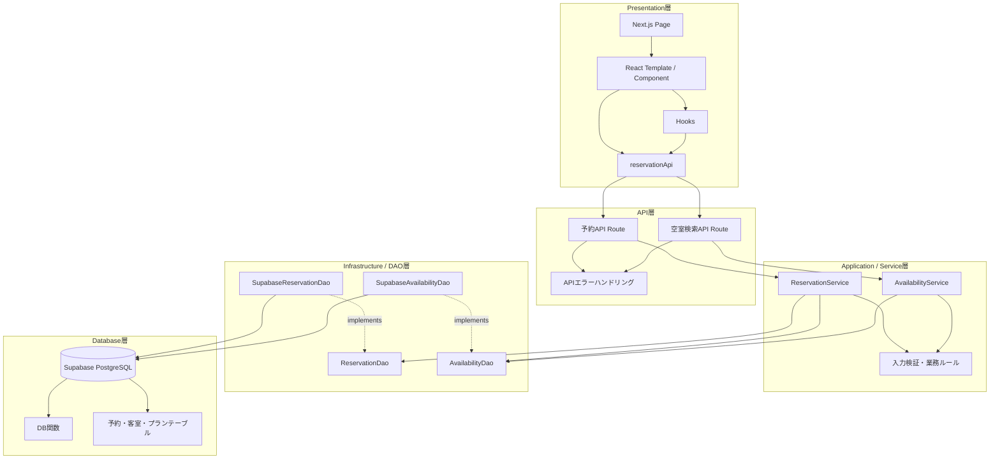

# アーキテクチャ設計

本システムは、画面表示、API受付、業務ロジック、データアクセス、データ保存の責務を分離したレイヤー構成とする。これにより、画面変更、業務ルール変更、データベース実装の変更が互いに影響しにくい構成にする。

## レイヤー構成図

## 各レイヤーの責務

| レイヤー | 主な責務 |
| --- | --- |
| Presentation層 | 画面表示、フォーム入力、ボタン操作、API呼び出し |
| API層 | HTTPリクエストの受付、レスポンス生成、エラー変換 |
| Application / Service層 | 入力検証、予約可否判定、予約作成・変更・キャンセルの業務ルール |
| Infrastructure / DAO層 | Supabaseへの問い合わせ、DB関数呼び出し、取得結果の整形 |
| Database層 | 予約・客室・プランの保存、トランザクション、行ロック、在庫整合性の保証 |

## 設計方針

- 画面は業務ロジックを直接持たず、APIを通して予約処理を依頼する。
- Service層に業務ルールを集約し、予約作成・変更・キャンセルで共通の検証を行う。
- DAO層をインターフェース化し、データベース実装への依存をService層から分離する。
- 在庫確認と予約保存はDatabase層のトランザクションと行ロックで行い、同時予約によるオーバーブッキングを防ぐ。
