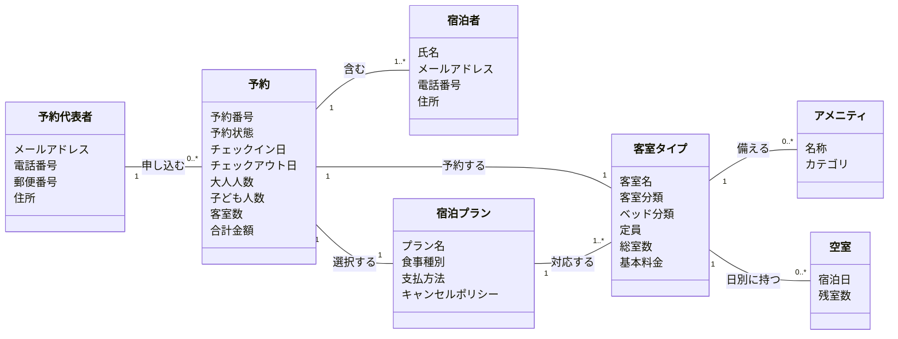
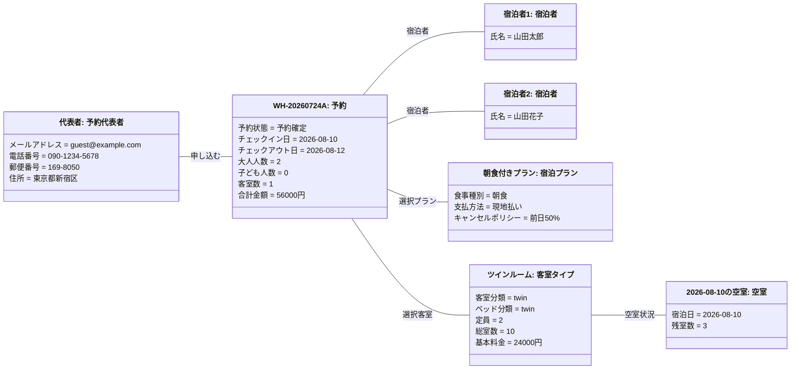

# 2.1 ドメイン分析

ドメイン分析では、ホテル予約業務に登場する概念、実体、関係を整理する。ここでは概念クラス図とオブジェクト図を用いて、業務上扱う対象を分析する。

## 概念クラス図

```mermaid
classDiagram
    direction LR

    class 宿泊者 {
        氏名
        メールアドレス
        電話番号
        住所
    }

    class 予約代表者 {
        メールアドレス
        電話番号
        郵便番号
        住所
    }

    class 予約 {
        予約番号
        予約状態
        チェックイン日
        チェックアウト日
        大人人数
        子ども人数
        客室数
        合計金額
    }

    class 宿泊プラン {
        プラン名
        食事種別
        支払方法
        キャンセルポリシー
    }

    class 客室タイプ {
        客室名
        客室分類
        ベッド分類
        定員
        総室数
        基本料金
    }

    class アメニティ {
        名称
        カテゴリ
    }

    class 空室 {
        宿泊日
        残室数
    }

    予約代表者 "1" -- "0..*" 予約 : 申し込む
    予約 "1" -- "1..*" 宿泊者 : 含む
    予約 "1" -- "1" 宿泊プラン : 選択する
    予約 "1" -- "1" 客室タイプ : 予約する
    宿泊プラン "1" -- "1..*" 客室タイプ : 対応する
    客室タイプ "1" -- "0..*" アメニティ : 備える
    客室タイプ "1" -- "0..*" 空室 : 日別に持つ
```

## オブジェクト図

```mermaid
classDiagram
    direction LR

    class representative["代表者: 予約代表者"] {
        メールアドレス = guest@example.com
        電話番号 = 090-1234-5678
        郵便番号 = 169-8050
        住所 = 東京都新宿区
    }

    class guest1["宿泊者1: 宿泊者"] {
        氏名 = 山田太郎
    }

    class guest2["宿泊者2: 宿泊者"] {
        氏名 = 山田花子
    }

    class reservation["WH-20260724A: 予約"] {
        予約状態 = 予約確定
        チェックイン日 = 2026-08-10
        チェックアウト日 = 2026-08-12
        大人人数 = 2
        子ども人数 = 0
        客室数 = 1
        合計金額 = 56000円
    }

    class plan["朝食付きプラン: 宿泊プラン"] {
        食事種別 = 朝食
        支払方法 = 現地払い
        キャンセルポリシー = 前日50%
    }

    class room["ツインルーム: 客室タイプ"] {
        客室分類 = twin
        ベッド分類 = twin
        定員 = 2
        総室数 = 10
        基本料金 = 24000円
    }

    class availability["2026-08-10の空室: 空室"] {
        宿泊日 = 2026-08-10
        残室数 = 3
    }

    representative -- reservation : 申し込む
    reservation -- guest1 : 宿泊者
    reservation -- guest2 : 宿泊者
    reservation -- plan : 選択プラン
    reservation -- room : 選択客室
    room -- availability : 空室状況
```
