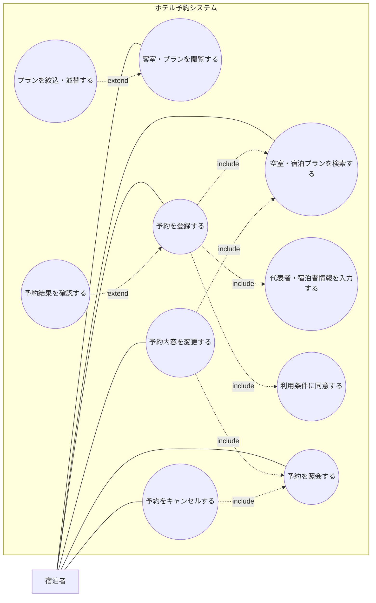
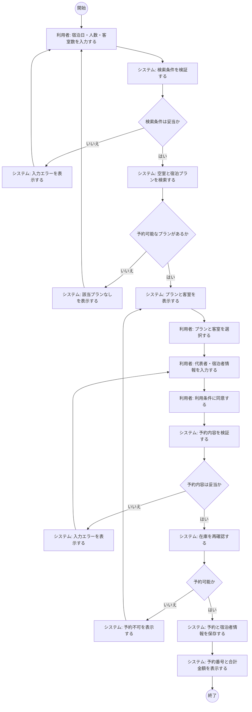
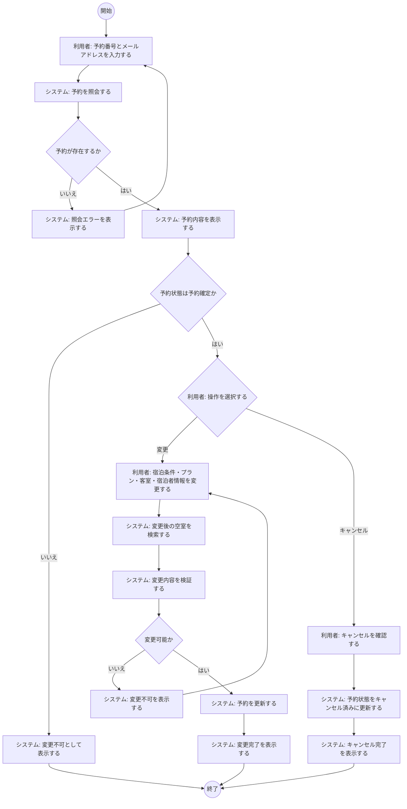

# 2.2 要求分析

要求分析では、利用者がシステムで何をしたいか、また利用者とシステムがどのような手順で処理を進めるかを整理する。ここではユースケース図とアクティビティ図を用いる。

## ユースケース図

```mermaid
flowchart LR
    guest["宿泊者"]

    subgraph system["ホテル予約システム"]
        search((空室・宿泊プランを検索する))
        browse((客室・プランを閲覧する))
        filter((プランを絞込・並替する))
        reserve((予約を登録する))
        inputGuest((代表者・宿泊者情報を入力する))
        agree((利用条件に同意する))
        showResult((予約結果を確認する))
        lookup((予約を照会する))
        change((予約内容を変更する))
        cancel((予約をキャンセルする))
    end

    guest --- search
    guest --- browse
    guest --- reserve
    guest --- lookup
    guest --- change
    guest --- cancel

    filter -.->|extend| browse
    reserve -.->|include| search
    reserve -.->|include| inputGuest
    reserve -.->|include| agree
    showResult -.->|extend| reserve
    change -.->|include| lookup
    change -.->|include| search
    cancel -.->|include| lookup
```

## 予約登録アクティビティ図

```mermaid
flowchart TD
    start((開始)) --> userInput[利用者: 宿泊日・人数・客室数を入力する]
    userInput --> systemValidateSearch[システム: 検索条件を検証する]
    systemValidateSearch --> validSearch{検索条件は妥当か}
    validSearch -- いいえ --> systemSearchError[システム: 入力エラーを表示する]
    systemSearchError --> userInput
    validSearch -- はい --> systemSearch[システム: 空室と宿泊プランを検索する]
    systemSearch --> hasPlan{予約可能なプランがあるか}
    hasPlan -- いいえ --> systemNoPlan[システム: 該当プランなしを表示する]
    systemNoPlan --> userInput
    hasPlan -- はい --> systemShowPlans[システム: プランと客室を表示する]
    systemShowPlans --> userSelect[利用者: プランと客室を選択する]
    userSelect --> userGuestInfo[利用者: 代表者・宿泊者情報を入力する]
    userGuestInfo --> userAgree[利用者: 利用条件に同意する]
    userAgree --> systemValidateReservation[システム: 予約内容を検証する]
    systemValidateReservation --> validReservation{予約内容は妥当か}
    validReservation -- いいえ --> systemReservationError[システム: 入力エラーを表示する]
    systemReservationError --> userGuestInfo
    validReservation -- はい --> systemRecheck[システム: 在庫を再確認する]
    systemRecheck --> available{予約可能か}
    available -- いいえ --> systemConflict[システム: 予約不可を表示する]
    systemConflict --> systemShowPlans
    available -- はい --> systemSave[システム: 予約と宿泊者情報を保存する]
    systemSave --> systemComplete[システム: 予約番号と合計金額を表示する]
    systemComplete --> finish((終了))
```

## 予約変更・キャンセルアクティビティ図

```mermaid
flowchart TD
    start((開始)) --> userCredential[利用者: 予約番号とメールアドレスを入力する]
    userCredential --> systemLookup[システム: 予約を照会する]
    systemLookup --> found{予約が存在するか}
    found -- いいえ --> systemLookupError[システム: 照会エラーを表示する]
    systemLookupError --> userCredential
    found -- はい --> systemShowReservation[システム: 予約内容を表示する]
    systemShowReservation --> confirmed{予約状態は予約確定か}
    confirmed -- いいえ --> readonly[システム: 変更不可として表示する]
    readonly --> finish((終了))
    confirmed -- はい --> userAction{利用者: 操作を選択する}
    userAction -- 変更 --> userEdit[利用者: 宿泊条件・プラン・客室・宿泊者情報を変更する]
    userEdit --> systemSearch[システム: 変更後の空室を検索する]
    systemSearch --> systemUpdateCheck[システム: 変更内容を検証する]
    systemUpdateCheck --> canUpdate{変更可能か}
    canUpdate -- いいえ --> systemUpdateError[システム: 変更不可を表示する]
    systemUpdateError --> userEdit
    canUpdate -- はい --> systemUpdate[システム: 予約を更新する]
    systemUpdate --> systemUpdateComplete[システム: 変更完了を表示する]
    systemUpdateComplete --> finish
    userAction -- キャンセル --> userConfirm[利用者: キャンセルを確認する]
    userConfirm --> systemCancel[システム: 予約状態をキャンセル済みに更新する]
    systemCancel --> systemCancelComplete[システム: キャンセル完了を表示する]
    systemCancelComplete --> finish
```
