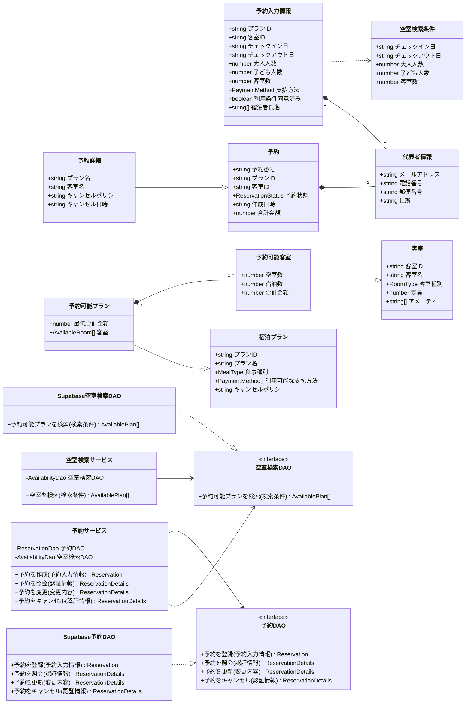
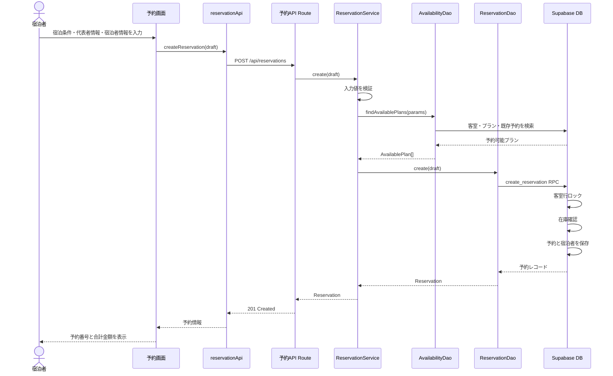
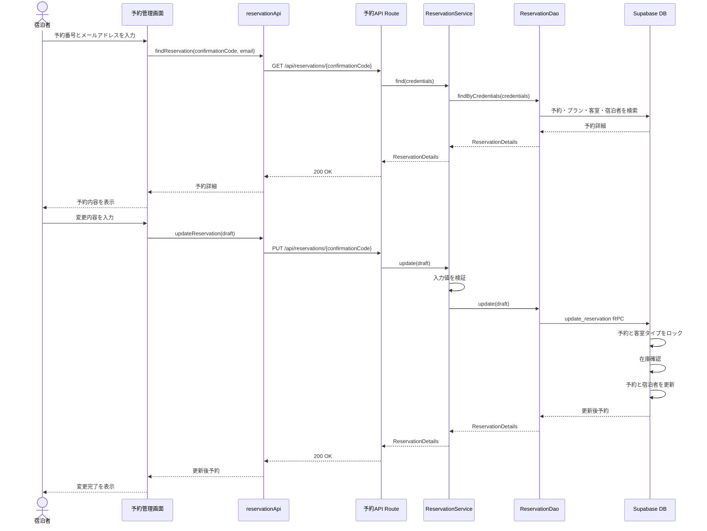
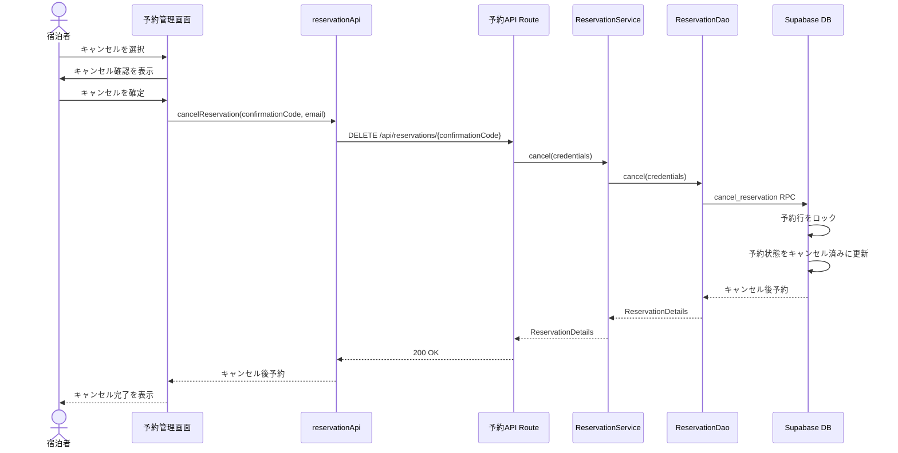

# 2.3 システム分析

システム分析では、システム内部のクラス、属性、関係、処理の流れを整理する。ここでは分析クラス図とシーケンス図を用いる。

## 分析クラス図

```mermaid
classDiagram
    direction LR

    class AvailabilitySearchParams["空室検索条件"] {
        +string チェックイン日
        +string チェックアウト日
        +number 大人人数
        +number 子ども人数
        +number 客室数
    }

    class RepresentativeInfo["代表者情報"] {
        +string メールアドレス
        +string 電話番号
        +string 郵便番号
        +string 住所
    }

    class ReservationDraft["予約入力情報"] {
        +string プランID
        +string 客室ID
        +string チェックイン日
        +string チェックアウト日
        +number 大人人数
        +number 子ども人数
        +number 客室数
        +PaymentMethod 支払方法
        +boolean 利用条件同意済み
        +string[] 宿泊者氏名
    }

    class Reservation["予約"] {
        +string 予約番号
        +string プランID
        +string 客室ID
        +ReservationStatus 予約状態
        +string 作成日時
        +number 合計金額
    }

    class ReservationDetails["予約詳細"] {
        +string プラン名
        +string 客室名
        +string キャンセルポリシー
        +string キャンセル日時
    }

    class Plan["宿泊プラン"] {
        +string プランID
        +string プラン名
        +MealType 食事種別
        +PaymentMethod[] 利用可能な支払方法
        +string キャンセルポリシー
    }

    class AvailablePlan["予約可能プラン"] {
        +number 最低合計金額
        +AvailableRoom[] 客室
    }

    class Room["客室"] {
        +string 客室ID
        +string 客室名
        +RoomType 客室種別
        +number 定員
        +string[] アメニティ
    }

    class AvailableRoom["予約可能客室"] {
        +number 空室数
        +number 宿泊数
        +number 合計金額
    }

    class AvailabilityService["空室検索サービス"] {
        -AvailabilityDao 空室検索DAO
        +空室を検索(検索条件) AvailablePlan[]
    }

    class ReservationService["予約サービス"] {
        -ReservationDao 予約DAO
        -AvailabilityDao 空室検索DAO
        +予約を作成(予約入力情報) Reservation
        +予約を照会(認証情報) ReservationDetails
        +予約を変更(変更内容) ReservationDetails
        +予約をキャンセル(認証情報) ReservationDetails
    }

    class AvailabilityDao["空室検索DAO"] {
        <<interface>>
        +予約可能プランを検索(検索条件) AvailablePlan[]
    }

    class ReservationDao["予約DAO"] {
        <<interface>>
        +予約を登録(予約入力情報) Reservation
        +予約を照会(認証情報) ReservationDetails
        +予約を更新(変更内容) ReservationDetails
        +予約をキャンセル(認証情報) ReservationDetails
    }

    class SupabaseAvailabilityDao["Supabase空室検索DAO"] {
        +予約可能プランを検索(検索条件) AvailablePlan[]
    }

    class SupabaseReservationDao["Supabase予約DAO"] {
        +予約を登録(予約入力情報) Reservation
        +予約を照会(認証情報) ReservationDetails
        +予約を更新(変更内容) ReservationDetails
        +予約をキャンセル(認証情報) ReservationDetails
    }

    ReservationDetails --|> Reservation
    ReservationDraft "1" *-- "1" RepresentativeInfo
    Reservation "1" *-- "1" RepresentativeInfo
    AvailablePlan --|> Plan
    AvailableRoom --|> Room
    AvailablePlan "1" *-- "1..*" AvailableRoom
    ReservationDraft ..> AvailabilitySearchParams
    AvailabilityService --> AvailabilityDao
    ReservationService --> AvailabilityDao
    ReservationService --> ReservationDao
    SupabaseAvailabilityDao ..|> AvailabilityDao
    SupabaseReservationDao ..|> ReservationDao
```

## 予約登録シーケンス図

```mermaid
sequenceDiagram
    actor Guest as 宿泊者
    participant UI as 予約画面
    participant ApiClient as reservationApi
    participant Route as 予約API Route
    participant Service as ReservationService
    participant AvailabilityDao as AvailabilityDao
    participant ReservationDao as ReservationDao
    participant DB as Supabase DB

    Guest->>UI: 宿泊条件・代表者情報・宿泊者情報を入力
    UI->>ApiClient: createReservation(draft)
    ApiClient->>Route: POST /api/reservations
    Route->>Service: create(draft)
    Service->>Service: 入力値を検証
    Service->>AvailabilityDao: findAvailablePlans(params)
    AvailabilityDao->>DB: 客室・プラン・既存予約を検索
    DB-->>AvailabilityDao: 予約可能プラン
    AvailabilityDao-->>Service: AvailablePlan[]
    Service->>ReservationDao: create(draft)
    ReservationDao->>DB: create_reservation RPC
    DB->>DB: 客室行ロック
    DB->>DB: 在庫確認
    DB->>DB: 予約と宿泊者を保存
    DB-->>ReservationDao: 予約レコード
    ReservationDao-->>Service: Reservation
    Service-->>Route: Reservation
    Route-->>ApiClient: 201 Created
    ApiClient-->>UI: 予約情報
    UI-->>Guest: 予約番号と合計金額を表示
```

## 予約変更シーケンス図

```mermaid
sequenceDiagram
    actor Guest as 宿泊者
    participant UI as 予約管理画面
    participant ApiClient as reservationApi
    participant Route as 予約API Route
    participant Service as ReservationService
    participant ReservationDao as ReservationDao
    participant DB as Supabase DB

    Guest->>UI: 予約番号とメールアドレスを入力
    UI->>ApiClient: findReservation(confirmationCode, email)
    ApiClient->>Route: GET /api/reservations/{confirmationCode}
    Route->>Service: find(credentials)
    Service->>ReservationDao: findByCredentials(credentials)
    ReservationDao->>DB: 予約・プラン・客室・宿泊者を検索
    DB-->>ReservationDao: 予約詳細
    ReservationDao-->>Service: ReservationDetails
    Service-->>Route: ReservationDetails
    Route-->>ApiClient: 200 OK
    ApiClient-->>UI: 予約詳細
    UI-->>Guest: 予約内容を表示

    Guest->>UI: 変更内容を入力
    UI->>ApiClient: updateReservation(draft)
    ApiClient->>Route: PUT /api/reservations/{confirmationCode}
    Route->>Service: update(draft)
    Service->>Service: 入力値を検証
    Service->>ReservationDao: update(draft)
    ReservationDao->>DB: update_reservation RPC
    DB->>DB: 予約と客室タイプをロック
    DB->>DB: 在庫確認
    DB->>DB: 予約と宿泊者を更新
    DB-->>ReservationDao: 更新後予約
    ReservationDao-->>Service: ReservationDetails
    Service-->>Route: ReservationDetails
    Route-->>ApiClient: 200 OK
    ApiClient-->>UI: 更新後予約
    UI-->>Guest: 変更完了を表示
```

## 予約キャンセルシーケンス図

```mermaid
sequenceDiagram
    actor Guest as 宿泊者
    participant UI as 予約管理画面
    participant ApiClient as reservationApi
    participant Route as 予約API Route
    participant Service as ReservationService
    participant ReservationDao as ReservationDao
    participant DB as Supabase DB

    Guest->>UI: キャンセルを選択
    UI->>Guest: キャンセル確認を表示
    Guest->>UI: キャンセルを確定
    UI->>ApiClient: cancelReservation(confirmationCode, email)
    ApiClient->>Route: DELETE /api/reservations/{confirmationCode}
    Route->>Service: cancel(credentials)
    Service->>ReservationDao: cancel(credentials)
    ReservationDao->>DB: cancel_reservation RPC
    DB->>DB: 予約行をロック
    DB->>DB: 予約状態をキャンセル済みに更新
    DB-->>ReservationDao: キャンセル後予約
    ReservationDao-->>Service: ReservationDetails
    Service-->>Route: ReservationDetails
    Route-->>ApiClient: 200 OK
    ApiClient-->>UI: キャンセル後予約
    UI-->>Guest: キャンセル完了を表示
```
