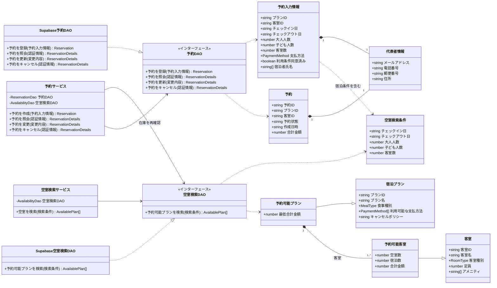
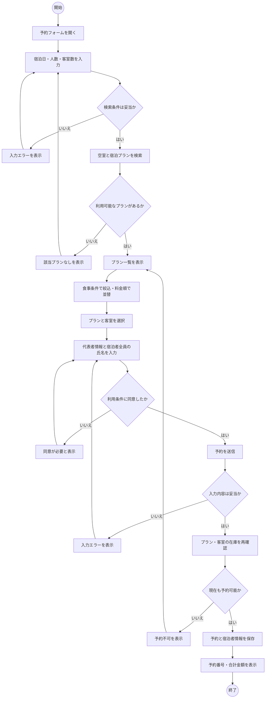
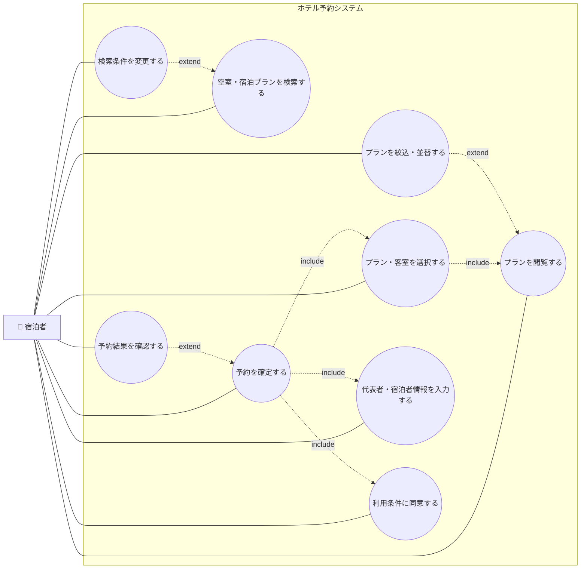
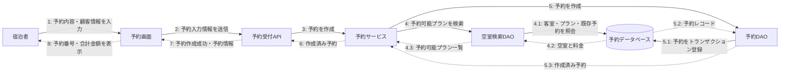

# ホテル予約システム UML 図

このドキュメントは、現在のユーザー向け予約機能を対象とする。Mermaid に専用記法がないユースケース図とコラボレーション図は、`flowchart` を使って UML の要素とメッセージ順を表現している。

## クラス図

## アクティビティ図

## ユースケース図

## コラボレーション図

予約確定時に、各オブジェクト間で送られるメッセージを番号付きで示す。

